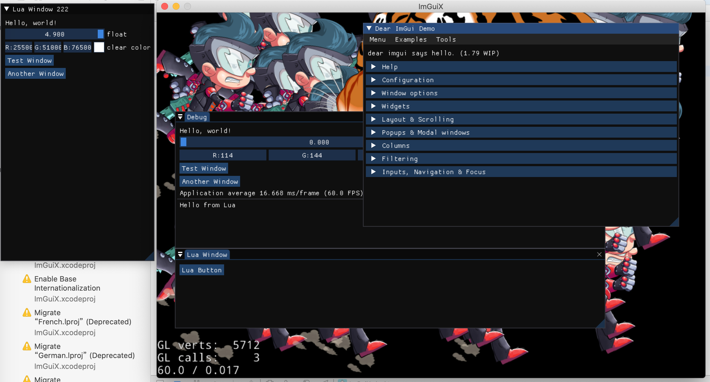

## Cocos2d-x-3.17.1 with imgui 1.7


1. Cocos2d-x is the engine: [https://github.com/cocos2d/cocos2d-x](https://github.com/cocos2d/cocos2d-x)
2. UI is rendered with Dear ImGui[https://github.com/ocornut/imgui](https://github.com/ocornut/imgui)
3. Open `proj.ios_mac/ImGuiX.xcodeproj/` to Test




## How to integrate imguix

- all you need are `Classes/imgui` folder

- create GLView:


  ```c++
// include headers
#include "CCImGuiLayer.h"
  ```

  ```c++
// add ImGUI layer on top. Example:
// https://github.com/c0i/imguix/blob/master/Classes/AppDelegate.cpp#L56
ImGuiLayer::createAndKeepOnTop();
  ```

## How to use

   ```c++
   // add ui callbacks
   CCIMGUI::getInstance()->addImGUI([=](){
       {
           ImGui::Text("Hello, world!");
       }
   }, "demoid");

   // remove ui callbacks to stop rendering
   CCIMGUI::getInstance()->removeImGUI("demoid");

   // create button with file name, auto pushID / popID with texture id
   CCIMGUI::getInstance()->imageButton("filename.png");

   // create button with SpriteFrameName, auto pushID / popID with texture id
   CCIMGUI:: getInstance()->imageButton("#framename");

   // chinese font
   // http://www.slackware.com/~alien/slackbuilds/wqy-zenhei-font-ttf/build/wqy-zenhei-0.4.23-1.tar.gz
   ImGuiIO &io = ImGui::GetIO();
   io.Fonts->AddFontFromFileTTF("res/wqy-zenhei.ttf", 18.0f, 0, io.Fonts->GetGlyphRangesChinese());
   ```

## Lua binding

1. Naming convention is converted as followed: `ImGui::ImageButton` -> `imgui.imageButton`

```lua
-- text
imgui.text("Hello, World!")

-- text button
imgui.button("text button")

-- new window
if imgui.begin("Toolbar") then
end

-- input text
buf = "input"
ret, buf = imgui.inputText("input", buf, 256)

-- slider
float = 3
ret, float = imgui.sliderFloat("float", float, 0, 8)

-- image button

-- create with image file name
if imgui.imageButton("res/1.png") then print("image button click 1") end
-- or create with sprite frame name
if imgui.imageButton("#CoinSpin01.png") then print("CoinSpin01 1") end
```

[more example in main.lua](Resources/res/main.lua)

## Thanks
1. https://github.com/Subtixx
2. https://github.com/Mjarkiew/cocos2dx-imgui
3. https://github.com/Xrysnow/cocos2d-x-imgui
4. https://github.com/c4games/engine-x
5. https://github.com/namkazt/CocosSVGSprite

