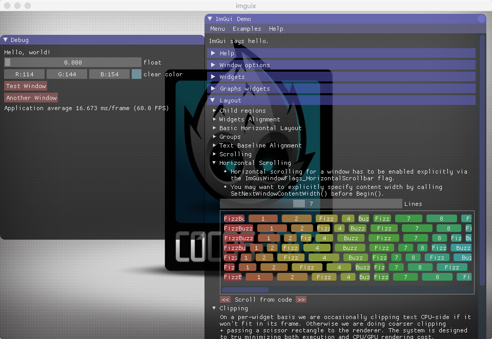

## cocos2d-x-3.8.1 with imgui

1. [https://github.com/cocos2d/cocos2d-x](https://github.com/cocos2d/cocos2d-x)
2. [https://github.com/ocornut/imgui](https://github.com/ocornut/imgui)




## how to integrate imguix

- all you need are `Classes/imgui` folder

- create GLView:


  ```
  // include headers
  #if (CC_TARGET_PLATFORM == CC_PLATFORM_WIN32) || (CC_TARGET_PLATFORM == CC_PLATFORM_MAC)
  #include "CCIMGUIGLViewImpl.h"
  #include "CCImGuiLayer.h"
  #endif
  ```

  ```
  // create glview
  director->setOpenGLView(IMGUIGLViewImpl::createWithRect("imguix", Rect(0, 0, width,   height)));
  ```

  ```
  // add imgui layer on the top
  #if (CC_TARGET_PLATFORM == CC_PLATFORM_WIN32) || (CC_TARGET_PLATFORM == CC_PLATFORM_MAC)
      // ImGui is always on the top
      Director::getInstance()->getScheduler()->schedule([](float)
      {
         if (!Director::getInstance()->getRunningScene()->getChildByName("ImGUILayer"))
         {
             Director::getInstance()->getRunningScene()->addChild(ImGuiLayer::create(), INT_MAX,   "ImGUILayer");
         }
      }, this, 0, false, "checkImGUI");
  #endif
  ```

## how to use

   ```c++
   // add ui
   CCIMGUI::getInstance()->addImGUI([=](){
       {
           ImGui::Text("Hello, world!");
       }
   }, "demoid");

   // remove ui
   CCIMGUI::getInstance()->removeImGUI("demoid");
   
   // create button with file name, auto pushID / popID with texture id
   CCIMGUI::getInstance()->imageButton("filename.png");
   
   // create button with SpriteFrameName, auto pushID / popID with texture id
   CCIMGUI:: getInstance()->imageButton("#framename");
   
   // chinese font
   // http://www.slackware.com/~alien/slackbuilds/wqy-zenhei-font-ttf/build/wqy-zenhei-0.4.23-1.tar.gz
   ImGuiIO &io = ImGui::GetIO();
   io.Fonts->AddFontFromFileTTF("res/wqy-zenhei.ttf", 18.0f, 0, io.Fonts->GetGlyphRangesChinese());
   ```

## lua binding

1. ImGui::ImageButton -> imgui.imageButton

```lua
-- text
imgui.text("Hello, World!")
    
-- text button
imgui.button("text button")
    
-- new window
if imgui.begin("Toolbar") then
end

-- input text
buf = "input"
ret, buf = imgui.inputText("input", buf, 256)

-- slider
float = 3
ret, float = imgui.sliderFloat("float", float, 0, 8)

-- image button

-- create with image file name
if imgui.imageButton("res/1.png") then print("image button click 1") end
-- or create with sprite frame name
if imgui.imageButton("#CoinSpin01.png") then print("CoinSpin01 1") end
```

[more example in main.lua](https://github.com/c0i/imguix/blob/master/Resources/res/main.lua)
