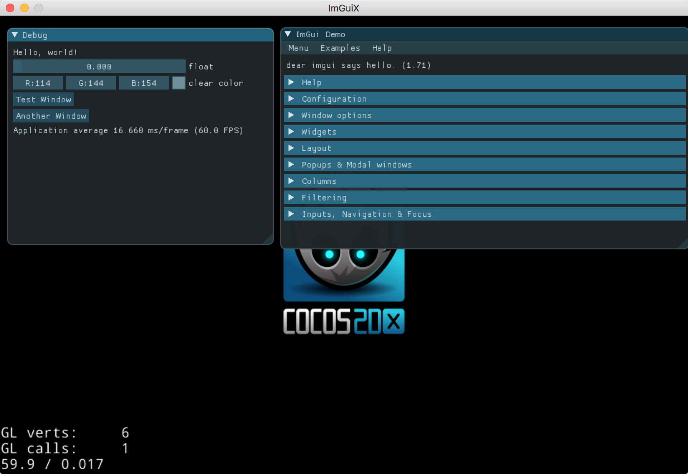

## cocos2d-x-3.8.1 with imgui

1. [https://github.com/cocos2d/cocos2d-x](https://github.com/cocos2d/cocos2d-x)
2. [https://github.com/ocornut/imgui](https://github.com/ocornut/imgui)

## issues

1. [imgui can not be drawn when porting to win32](https://github.com/jrdeng/imguix/issues/1)

